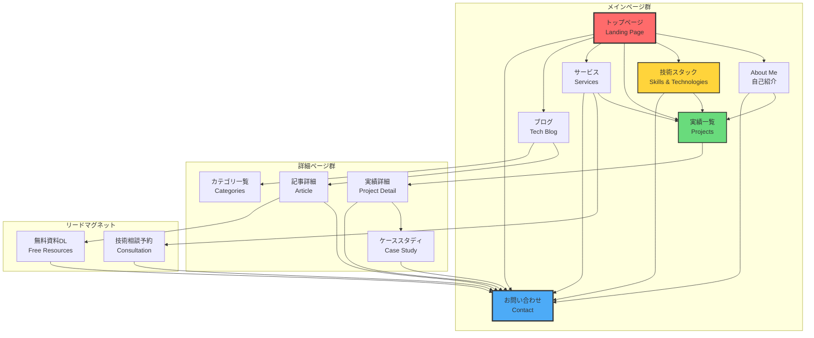
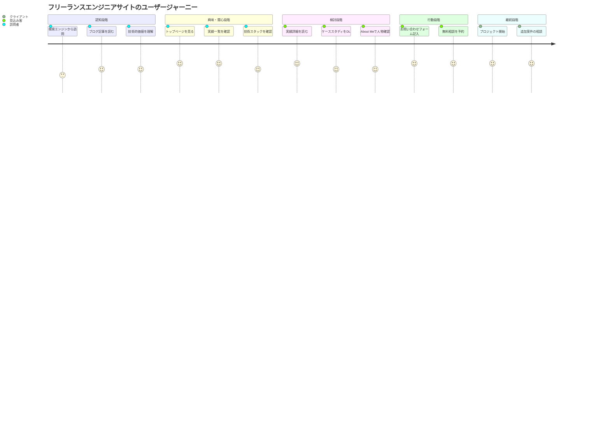

# フリーランスエンジニアサイト構成設計書

## 🏗️ サイト構成設計

### 📑 ページ構成と遷移図



### 🎯 各ページの役割と内容

| ページ名 | URL構造 | 主な役割 | 掲載内容 | CTA |
|---------|---------|----------|----------|-----|
| **トップページ** | `/` | ファーストビュー<br/>価値提案 | • ヒーローセクション（キャッチコピー）<br/>• 3つの強み<br/>• 実績サマリー<br/>• 最新ブログ記事 | 「実績を見る」<br/>「お問い合わせ」 |
| **About Me** | `/about/` | 信頼獲得<br/>人物理解 | • プロフィール写真<br/>• 経歴・ストーリー<br/>• 価値観・ミッション<br/>• 保有資格 | 「技術スタックを見る」<br/>「実績を見る」 |
| **技術スタック** | `/skills/` | 技術力証明<br/>専門性提示 | • スキルマップ（視覚的）<br/>• 経験年数グラフ<br/>• 得意分野（Java/Spring Boot強調）<br/>• 技術スタック一覧 | 「実績を見る」<br/>「お問い合わせ」 |
| **実績一覧** | `/projects/` | 実績提示<br/>信頼性向上 | • プロジェクトカード（9件）<br/>• フィルター機能（技術/業界別）<br/>• 成果数値の強調 | 「詳細を見る」<br/>「お問い合わせ」 |
| **実績詳細** | `/projects/{id}/` | 深い理解<br/>技術力証明 | • プロジェクト概要<br/>• 技術的課題と解決策<br/>• 使用技術詳細<br/>• 成果・効果<br/>• クライアントの声 | 「ケーススタディをDL」<br/>「類似案件の相談」 |
| **サービス** | `/services/` | サービス理解<br/>料金提示 | • 3つのサービスプラン<br/>• 料金目安<br/>• 作業フロー<br/>• FAQ | 「無料相談を予約」<br/>「お問い合わせ」 |
| **ブログ** | `/blog/` | 専門性証明<br/>SEO対策 | • 技術記事一覧<br/>• カテゴリ分類<br/>• 人気記事ランキング | 「記事を読む」<br/>「メルマガ登録」 |
| **お問い合わせ** | `/contact/` | リード獲得 | • 問い合わせフォーム<br/>• 対応可能時間<br/>• よくある質問 | 「送信する」 |

### 🔄 ユーザージャーニーマップ



### 📊 ページ別の詳細設計

#### 1. トップページ（Landing Page）
```
構成要素:
├── ヒーローセクション
│   ├── キャッチコピー: 「レガシーシステムを、次世代へ」
│   ├── サブコピー: 「10年以上の経験を持つJava/Spring Boot専門家」
│   └── CTAボタン: 「実績を見る」「お問い合わせ」
├── 3つの強み
│   ├── レガシーシステム移行のプロ
│   ├── フルスタック対応力
│   └── 確実性重視の開発
├── 実績サマリー
│   ├── 完了プロジェクト数: 9件
│   ├── 技術スタック数: 15+
│   └── 開発経験年数: 10年+
├── 最新ブログ記事（3件）
└── フッターCTA
```

#### 2. 技術スタック可視化ページ（/skills/）
```
構成要素:
├── スキルレーダーチャート
│   ├── バックエンド（Java/Spring Boot）: ★★★★★
│   ├── フロントエンド（JavaScript/Vue）: ★★★★☆
│   ├── データベース（SQL）: ★★★★★
│   ├── インフラ（AWS/Docker）: ★★★☆☆
│   └── その他（Git/CI/CD）: ★★★★☆
├── 経験年数タイムライン
│   ├── Java: 8年
│   ├── JavaScript: 6年
│   ├── Python: 5年
│   ├── Ruby: 3年
│   └── PHP: 3年
├── 得意分野（3つ）
│   ├── レガシーシステムのモダン化
│   ├── Spring Boot開発
│   └── チーム開発・リーダーシップ
└── 技術スタック一覧（タグクラウド形式）
```

#### 3. 実績詳細ページ（/projects/{id}/）
```
構成要素:
├── プロジェクトヘッダー
│   ├── タイトル
│   ├── 期間
│   ├── 役割
│   └── チーム規模
├── 課題と解決策
│   ├── Before（課題）
│   ├── アプローチ
│   └── After（成果）
├── 技術詳細
│   ├── 使用技術スタック
│   ├── アーキテクチャ図
│   └── 技術的ポイント
├── 成果・数値
│   ├── 改善率
│   ├── 処理速度向上
│   └── コスト削減
├── クライアントの声（あれば）
└── 関連プロジェクト
```

### 📱 レスポンシブ対応

| デバイス | ブレークポイント | 表示調整 |
|----------|-----------------|----------|
| **PC** | 1024px以上 | • 3カラムレイアウト<br/>• サイドバー表示<br/>• ホバーエフェクト有効 |
| **タブレット** | 768px〜1023px | • 2カラムレイアウト<br/>• サイドバー折りたたみ<br/>• タッチ最適化 |
| **スマートフォン** | 767px以下 | • 1カラムレイアウト<br/>• ハンバーガーメニュー<br/>• CTAボタン固定表示 |

### 🎨 デザインシステム

```yaml
カラーパレット:
  primary: 
    main: "#2563eb"      # 信頼性のブルー
    light: "#3b82f6"
    dark: "#1e40af"
  secondary:
    main: "#10b981"      # 成功のグリーン
    light: "#34d399"
    dark: "#059669"
  accent:
    main: "#f59e0b"      # 注目のオレンジ
    light: "#fbbf24"
    dark: "#d97706"
  neutral:
    text: "#1f2937"      # メインテキスト
    subtext: "#6b7280"   # サブテキスト
    border: "#e5e7eb"    # ボーダー
    background: "#ffffff" # 背景

タイポグラフィ:
  font-family:
    heading: "'Noto Sans JP', sans-serif"
    body: "'Hiragino Sans', 'Yu Gothic', sans-serif"
    code: "'Source Code Pro', monospace"
  font-size:
    h1: "2.5rem"         # 40px
    h2: "2rem"           # 32px
    h3: "1.5rem"         # 24px
    body: "1rem"         # 16px
    small: "0.875rem"    # 14px

コンポーネント:
  button:
    primary:
      background: "primary.main"
      hover: "primary.dark"
      text: "white"
    secondary:
      background: "transparent"
      border: "primary.main"
      text: "primary.main"
  card:
    shadow: "0 4px 6px rgba(0,0,0,0.1)"
    border-radius: "8px"
    padding: "24px"
```

### 🔍 SEO対策

| ページ | ターゲットキーワード | メタディスクリプション |
|--------|---------------------|----------------------|
| トップ | フリーランス エンジニア Java | 10年以上の経験を持つJava/Spring Boot専門のフリーランスエンジニア。レガシーシステムのモダン化が得意です。 |
| 技術スタック | Java Spring Boot 開発 | Java 8年、Spring Boot専門。フルスタック対応可能な技術スタックを紹介。 |
| 実績一覧 | システム開発 実績 事例 | 銀行・通信・公共など幅広い業界での開発実績9件を紹介。 |
| ブログ | Spring Boot 移行 レガシーシステム | レガシーシステムモダン化の技術ブログ。実践的なノウハウを発信。 |

### 📈 計測項目（Google Analytics）

```javascript
// 主要な計測イベント
{
  "page_view": "全ページ",
  "cta_click": {
    "contact": "お問い合わせボタン",
    "download": "資料ダウンロード",
    "project_detail": "実績詳細へ"
  },
  "form_submit": {
    "contact": "お問い合わせフォーム",
    "consultation": "無料相談予約"
  },
  "scroll_depth": "25%, 50%, 75%, 100%",
  "time_on_page": "滞在時間"
}
```

### 🚀 実装優先順位

1. **Phase 1（必須）**: トップページ、About Me、実績一覧、お問い合わせ
2. **Phase 2（重要）**: 技術スタック、実績詳細、ブログ基盤
3. **Phase 3（追加）**: サービス、リードマグネット、ブログ記事充実

---
*作成日: 2025年8月6日*
*最終更新: 2025年8月6日*